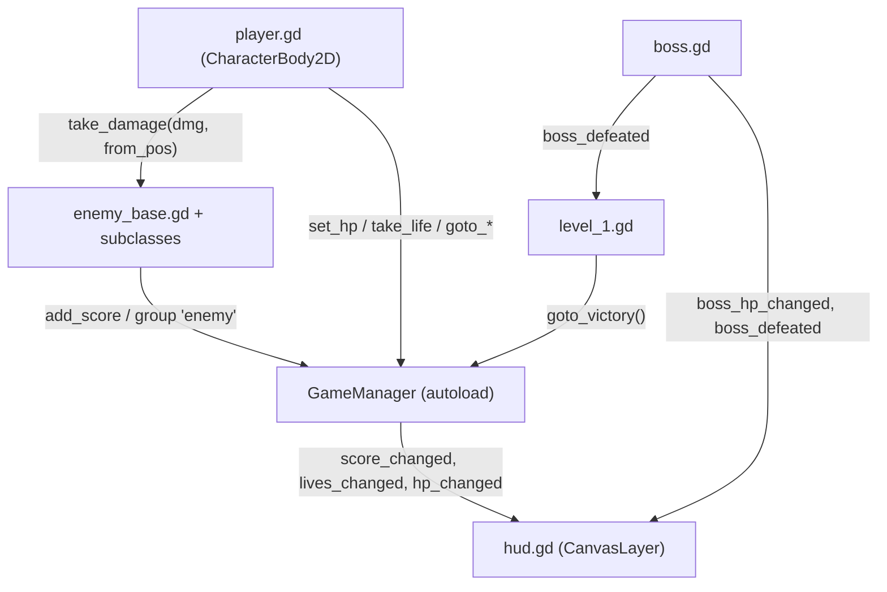

# Steel Streets — Architecture

Reference for how the bundled `steel_streets/` demo project is wired. Every
statement here is derived from the files in this directory; keep it in sync
when the scripts change, since it is the primary context source for generated
documentation and for agents working in this repo.

## At a glance

| Property | Value |
| --- | --- |
| Engine features | `4.3`, `GL Compatibility` (`project.godot`) |
| Renderer | `gl_compatibility` (desktop and mobile) |
| Internal viewport | 160x144, window override 640x576, `stretch/mode="viewport"` |
| Texture filter | nearest (`default_texture_filter=0`), 2D transforms/vertices snapped to pixel |
| Main scene | `res://scenes/title_screen.tscn` |
| Autoload | `GameManager` → `res://scripts/game_manager.gd` |
| Language | GDScript only — no C#, no GDExtension, no custom engine module |

The project is a plain Godot 4 project that happens to live inside the engine
repository. It does **not** build with SCons and is not part of the engine's
`--test` suite; nothing under `core/`, `scene/`, or `modules/` depends on it.

## Scripts

All scripts use `extends` (path-based inheritance). None of them declare
`class_name`, so the types are not registered in `ClassDB` and are referenced
either by scene instantiation or by `preload()` of the script path.

| Script | Extends | Responsibility |
| --- | --- | --- |
| `game_manager.gd` | `Node` (autoload) | Lives, score, HP, and the five `goto_*` scene transitions |
| `player.gd` | `CharacterBody2D` | Walk/jump/climb/melee, i-frames, knockback, death → life loss |
| `enemy_base.gd` | `CharacterBody2D` | HP, contact damage, hit flash, death handshake (score + `queue_free`) |
| `foot_soldier.gd` | `enemy_base.gd` | Patrol with ledge/wall turnaround, chases within 70 px |
| `shuriken_thrower.gd` | `enemy_base.gd` | Paces ±14 px, fires `projectile.tscn` every 1.6 s within 110 px |
| `boss.gd` | `enemy_base.gd` | 4-state charge cycle, 9 HP, own `boss_hp_changed` / `boss_defeated` signals |
| `projectile.gd` | `Area2D` | Straight-line shuriken, 3 s lifetime, despawns on `TileMap`/`StaticBody2D` |
| `question_block.gd` | `Area2D` | Score + heal pickup, consumable by touch or by a player attack area |
| `hud.gd` | `CanvasLayer` | Hearts, lives, score, optional boss bar |
| `level_1.gd` | `Node2D` | Builds the entire level procedurally (see below) |
| `anim_util.gd` | `Object` | `static func build(specs) -> SpriteFrames` from horizontal strips |
| `title_screen.gd`, `splash_screen.gd`, `game_over.gd`, `victory.gd` | screen scripts | Input-to-advance front-end screens |

## Global state and signals

`GameManager` is the only global. It owns `lives` (3), `score`, `max_hp` /
`current_hp` (5) and emits `score_changed`, `lives_changed`, and `hp_changed`;
`hud.gd` is the only subscriber. Entities call into it directly
(`GameManager.add_score`, `.set_hp`, `.heal`, `.take_life`, `.goto_*`) rather
than routing through signals.

Boss health is *not* on `GameManager`: `boss.gd` emits `boss_hp_changed` and
`boss_defeated`, and `level_1.gd` hands the boss instance to the HUD via
`hud.attach_boss(boss)` (deferred one frame so the HUD is ready).



Node groups do the loose coupling: `player`, `enemy`, `boss`, `player_attack`
(the player's `AttackHitbox` area), and `ladder`. Lookups use
`get_tree().get_first_node_in_group("player")`.

## Combat and damage flow

- The player's attack is an `Area2D` (`AttackHitbox`) enabled only during the
  swing window (`attack_timer < ATTACK_TIME * 0.75`), offset ±10 px by facing.
- `enemy_base.gd` listens on its own `Hurtbox.area_entered`, checks the
  `player_attack` group, and asks the attacker for `get_attack_damage()`.
- Enemies damage the player through `Hitbox.body_entered` →
  `player.take_damage(contact_damage, global_position)`.
- Damage gives 1.2 s of invincibility (sprite strobes at 12 Hz) plus knockback
  away from the source; reaching 0 HP calls `GameManager.take_life()`, which
  either restarts the level or routes to the game-over screen.

## Physics layers

Defined in `project.godot` under `[layer_names]` — eight named 2D layers:

| Bit | Layer | Used by |
| --- | --- | --- |
| 1 | `world` | TileSet physics layer for solid tiles |
| 2 | `player` | Player body; masked by ladders, spikes, enemy hitboxes |
| 3 | `player_hitbox` | Player melee area |
| 4 | `enemy` | Enemy bodies |
| 5 | `enemy_hitbox` | Enemy contact/hurt areas |
| 6 | `ladder` | Ladder areas built in `level_1.gd` (`collision_layer = 32`) |
| 7 | `pickup` | Question blocks |
| 8 | `hazard` | Spikes (`collision_layer = 128`, mask `2`) |

## Level construction

`level_1.gd` builds everything at `_ready()` instead of shipping a large
`.tscn`:

1. `_build_tileset()` creates a `TileSet` at runtime with a
   `TileSetAtlasSource` over `assets/sprites/tiles/tileset.png`, 11 tiles in a
   single atlas row, one physics layer on collision layer 1, and a full-tile
   collision polygon for the three solid tiles.
2. The scene uses a **`TileMap`** node with two layers — layer 0 background
   (sky, brick, windows, doors, clouds), layer 1 foreground/solid platforms.
   This is the legacy `TileMap` API, not `TileMapLayer` nodes.
3. Ladders, spikes, pickups, enemies, the boss, the player, and the HUD are
   instantiated from the constant tables at the top of the file
   (`PLATFORMS`, `LADDERS`, `SPIKES`, `PICKUPS`, `FOOT_SOLDIERS`,
   `SHURIKEN_THROWERS`, `BOSS_POS`, `PLAYER_SPAWN`).
4. A `Camera2D` is created in code, parented to the player, smoothing enabled,
   limits clamped to the 100x9 tile (16 px) world.

There is **no navigation**: enemies do not use `NavigationAgent2D` or the
navigation server. Movement is `move_and_slide()` plus a downward
`PhysicsRayQueryParameters2D` ledge probe in `foot_soldier.gd`.

Enemy AI states are plain `enum`/`match` state machines inside
`_physics_process` (`boss.gd`: `PAUSE → WINDUP → CHARGE → RECOVER`).

## Sprite animation

Sprite sheets are horizontal strips. `anim_util.gd` builds a `SpriteFrames`
resource at runtime by slicing the strip into `AtlasTexture` regions, so no
`.tres` animation resources are committed. Each entity declares its own
`FRAMES_SPEC` constant (`name`, `path`, `count`, `w`, `h`, `fps`, `loop`).

## Asset pipeline

`tools/gen_assets.py` (not the project root) regenerates **every** PNG and WAV
from code:

```bash
python3 steel_streets/tools/gen_assets.py   # requires Pillow; paths resolve relative to the script
```

It draws pixel art with Pillow in the four-colour Game Boy palette and
synthesizes chiptune SFX/BGM with the stdlib `wave` module. It does not create
`SpriteFrames`, `AnimatedTexture`, or `.tres` resources — `.import` files are
generated by the editor on first import.

## Running

```bash
godot --path steel_streets                       # play
godot --path steel_streets --headless --quit     # import/parse smoke check
```

A headless run with `--quit` is the cheapest way to verify that every scene and
script still parses after a change; there are no unit tests for this project.
